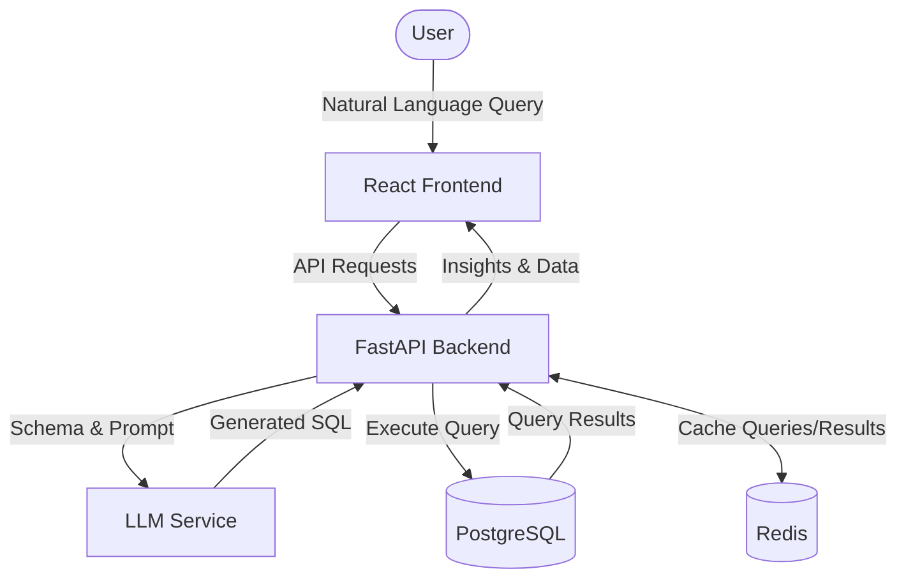

# InsightSQL (AI SQL Analytics Assistant)

InsightSQL is an intelligent analytics assistant that allows you to query your database using natural language. It translates your questions into optimized SQL queries, executes them against your database, and returns the insights you need—all within an intuitive web interface.

## 🚀 Features

- **Natural Language to SQL**: Powered by LLMs to seamlessly translate plain English questions into accurate SQL queries.
- **FastAPI Backend**: High-performance backend built with Python, FastAPI, and SQLAlchemy.
- **React Frontend**: Modern, fast, and responsive user interface built with React and Vite.
- **Database Support**: Built-in support for PostgreSQL databases.
- **Caching**: Redis integration for high-performance query caching.

## 🛠️ Tech Stack

### Backend
- Python 3.x
- [FastAPI](https://fastapi.tiangolo.com/)
- [SQLAlchemy](https://www.sqlalchemy.org/)
- [PostgreSQL](https://www.postgresql.org/)
- [Redis](https://redis.io/)

### Frontend
- [React 19](https://react.dev/)
- [Vite](https://vitejs.dev/)

## 🏗️ Architecture



## 📦 Project Structure

```
.
├── backend/                # FastAPI backend application
│   ├── app/
│   │   ├── api/            # API routing and endpoints
│   │   ├── core/           # Core configuration settings
│   │   ├── database/       # Database connection setup
│   │   ├── execution/      # Query execution logic
│   │   ├── ingestion/      # Data ingestion and schema parsing
│   │   ├── llm/            # LLM integration for text-to-SQL
│   │   ├── models/         # SQLAlchemy ORM models
│   │   ├── schemas/        # Pydantic validation schemas
│   │   └── services/       # Core business logic services
│   ├── requirements.txt    # Python dependencies
│   └── Dockerfile          # Backend Docker configuration
├── frontend/               # React & Vite frontend application
│   └── package.json        # Frontend dependencies
├── docker-compose.yml      # Multi-container Docker setup
└── README.md               # Project documentation
```

## 🐳 Getting Started (Docker)

The easiest way to get the entire stack running is using Docker Compose. This will spin up the Backend, Frontend, PostgreSQL database, and Redis cache automatically.

### Prerequisites
- [Docker](https://docs.docker.com/get-docker/)
- [Docker Compose](https://docs.docker.com/compose/install/)

### Running the Application

1. Clone the repository and navigate to the project directory:
   ```bash
   cd ai-sql-analytics-assistant
   ```

2. Start the services using Docker Compose:
   ```bash
   docker-compose up --build
   ```

3. Access the services:
   - **Frontend UI**: `http://localhost:5173`
   - **Backend API Docs (Swagger UI)**: `http://localhost:8000/docs`
   - **PostgreSQL**: `localhost:5432`
   - **Redis**: `localhost:6379`

## 💻 Local Development Setup

If you prefer to run the services locally without Docker, follow these steps:

### Backend Setup

1. Navigate to the backend directory:
   ```bash
   cd backend
   ```
2. Create and activate a virtual environment:
   ```bash
   python -m venv venv
   source venv/bin/activate  # On Windows use `venv\Scripts\activate`
   ```
3. Install the required dependencies:
   ```bash
   pip install -r requirements.txt
   ```
4. Run the FastAPI development server:
   ```bash
   uvicorn app.main:app --reload
   ```

### Frontend Setup

1. Navigate to the frontend directory:
   ```bash
   cd frontend
   ```
2. Install the dependencies:
   ```bash
   npm install
   ```
3. Run the Vite development server:
   ```bash
   npm run dev
   ```

## 📝 License

This project is licensed under the MIT License.
